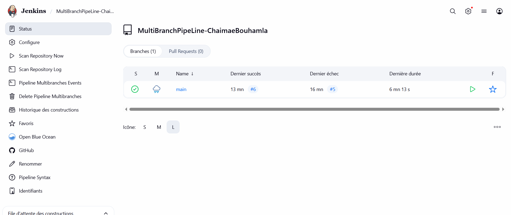
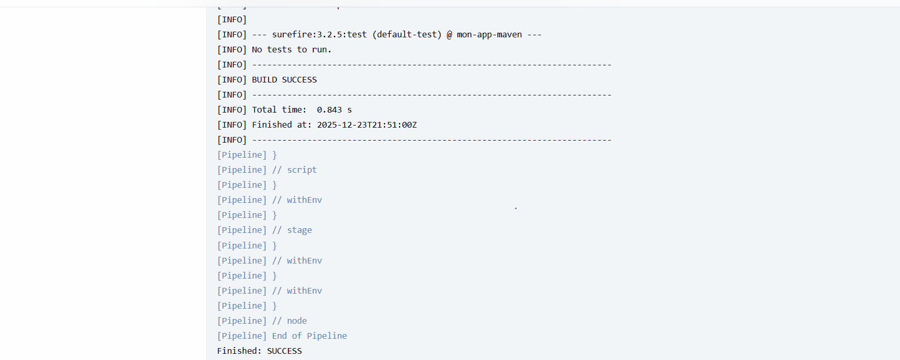

# TP Jenkins : MultiBranch Pipeline

**Réalisé par :**Chaimae Bouhamla 
**Projet :** MultiBranchPipeLine-ChaimaeBouhamla

## 1. Description du projet
Ce projet met en place un pipeline d'intégration continue (CI) utilisant Jenkins en mode "MultiBranch Pipeline". Le but est de compiler et tester automatiquement le code Java (Maven) à chaque modification sur la branche `main`.

## 2. Configuration Jenkins
Le pipeline est défini via un fichier `Jenkinsfile` situé à la racine du projet. Il contient les étapes suivantes :
- **Checkout :** Récupération du code source depuis GitHub.
- **Build :** Compilation du projet avec `mvn clean install`.
- **Test :** Exécution des tests unitaires.

## 3. Exécution du Pipeline (Preuves)

### Vue globale du succès
Le tableau de bord Jenkins montre que la branche `main` a été construite avec succès (Build #6).

### Sortie de la console (Log)
Le log confirme que Maven a bien téléchargé les dépendances et compilé le projet sans erreur ("BUILD SUCCESS").

## 4. Difficultés rencontrées et solutions
Durant ce TP, j'ai rencontré une erreur `UnknownHostException` (problème de DNS Docker) qui empêchait Jenkins de se connecter à Internet.
**Solution :** J'ai configuré le fichier `daemon.json` de Docker pour utiliser le DNS `8.8.8.8`, ce qui a permis de résoudre le problème et de valider le pipeline.# MultiBranchPipeLine-ChaimaeBouhamla